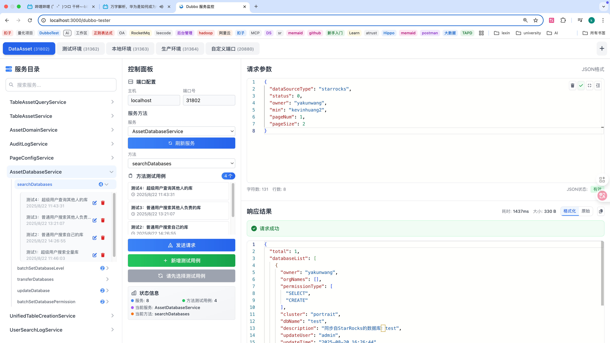

# Dubbo 服务监控



这是一个用于监控和测试 Dubbo 服务的 Web 应用程序。它提供了一个友好的 Web 界面，让你可以：

- 查看所有已注册的 Dubbo 服务
- 查看服务的方法列表
- 在线测试服务方法调用
- 保存和管理测试历史记录
- 管理端口配置

## 技术栈

后端：
- Spring Boot 2.7.0
- Apache Dubbo 3.2.0
- ZooKeeper (用于服务发现)
- MySQL (用于存储历史记录)

前端：
- React 18
- TypeScript
- Tailwind CSS
- Vite
- Axios (用于API调用)

## 系统要求

- JDK 8 或更高版本
- Node.js 14 或更高版本
- ZooKeeper 服务器
- MySQL 数据库

## 项目结构

### 前端目录结构
```
src/
├── main.tsx                    # 应用入口
├── App.tsx                     # 主应用组件
├── index.css                   # 全局样式
├── vite-env.d.ts              # Vite类型定义
├── components/                 # 组件目录
│   ├── DubboTester/           # Dubbo测试相关组件
│   │   ├── ServiceDirectory.tsx
│   │   ├── ControlPanel.tsx
│   │   ├── RequestPanel.tsx
│   │   ├── ResponsePanel.tsx
│   │   └── PortTabs.tsx
│   └── common/                # 通用组件
├── pages/                     # 页面组件
│   ├── Home.tsx
│   └── DubboTester.tsx
├── hooks/                     # 自定义hooks
│   ├── useDubboTester.ts
│   └── useTheme.ts
├── contexts/                  # React Context
│   └── authContext.ts
├── lib/                       # 工具库
│   ├── api.ts                 # API调用
│   ├── utils.ts               # 工具函数
│   └── types.ts               # 类型定义
└── assets/                    # 静态资源
```

### 后端目录结构
```
src/main/java/com/lexin/dubbo/monitor/
├── DubboMonitorApplication.java    # 主启动类
├── dao/                           # 数据访问层
│   ├── dao/                       # MyBatis Mapper接口
│   └── domain/                    # 数据模型
├── service/                       # 业务服务层
│   ├── controller/                # REST控制器
│   ├── service/                   # 服务接口
│   ├── impl/                      # 服务实现
│   ├── req/                       # 请求模型
│   └── resp/                      # 响应模型
└── impl/                          # 实现层
    ├── common/                    # 通用工具
    ├── impl/                      # 业务实现
    └── logic/                     # 业务逻辑
```

## 快速开始

### 🚀 一键启动（推荐）

项目提供便捷的启动脚本，可以一键启动前后端服务：

```bash
# 启动开发环境（自动检测端口并启动服务）
./start-dev.sh

# 停止开发环境
./stop-dev.sh
```

**启动脚本功能：**
- 🔍 自动检测并终止占用端口 3000 和 8080 的进程
- ☕ 检查 Java、Maven、pnpm 环境
- 📦 自动编译后端项目
- 🚀 启动后端服务（端口 8080）
- 🌐 启动前端服务（端口 3000）
- 📊 显示服务状态和进程信息

**服务访问地址：**
- 🌐 前端界面：http://localhost:3000
- 🔧 后端API：http://localhost:8080

### 🔧 手动启动

1. 启动 ZooKeeper 服务器

2. 启动 MySQL 数据库并创建数据库表
```sql
-- 方法1：使用完整的初始化脚本
-- 执行 src/main/resources/sql/step_by_step.sql 文件

-- 方法2：分步执行
-- 1. 创建数据库
CREATE DATABASE IF NOT EXISTS `dubbo_monitor` DEFAULT CHARACTER SET utf8mb4 COLLATE utf8mb4_unicode_ci;

-- 2. 使用数据库
USE `dubbo_monitor`;

-- 3. 创建执行记录表
CREATE TABLE `execute_request` (
    `id` BIGINT(20) NOT NULL AUTO_INCREMENT COMMENT '主键ID',
    `service_name` VARCHAR(255) NOT NULL COMMENT '服务名称',
    `method_name` VARCHAR(255) NOT NULL COMMENT '方法名称',
    `request_params` TEXT COMMENT '请求参数',
    `response_data` TEXT COMMENT '响应数据',
    `execute_time` BIGINT(20) COMMENT '执行时间(毫秒)',
    `port` INT(11) COMMENT '端口号',
    `create_time` TIMESTAMP DEFAULT CURRENT_TIMESTAMP COMMENT '创建时间',
    `update_time` TIMESTAMP DEFAULT CURRENT_TIMESTAMP ON UPDATE CURRENT_TIMESTAMP COMMENT '更新时间',
    PRIMARY KEY (`id`)
) ENGINE=InnoDB DEFAULT CHARSET=utf8mb4 COMMENT='执行记录表';

-- 4. 创建端口配置表
CREATE TABLE `execute_port` (
    `id` BIGINT(20) NOT NULL AUTO_INCREMENT COMMENT '主键ID',
    `port_name` VARCHAR(100) NOT NULL COMMENT '端口名称',
    `port` INT(11) NOT NULL COMMENT '端口号',
    `local_addr` VARCHAR(255) DEFAULT NULL COMMENT '本地地址',
    `create_time` TIMESTAMP DEFAULT CURRENT_TIMESTAMP COMMENT '创建时间',
    `update_time` TIMESTAMP DEFAULT CURRENT_TIMESTAMP ON UPDATE CURRENT_TIMESTAMP COMMENT '更新时间',
    PRIMARY KEY (`id`),
    UNIQUE KEY `uk_port_name` (`port_name`),
    UNIQUE KEY `uk_port` (`port`)
) ENGINE=InnoDB DEFAULT CHARSET=utf8mb4 COMMENT='端口配置表';

-- 5. 插入示例数据
INSERT INTO `execute_port` (`port_name`, `port`, `local_addr`) VALUES
('默认端口', 20880, '127.0.0.1'),
('测试端口', 20881, '127.0.0.1'),
('开发端口', 20882, '127.0.0.1');
```

3. 启动后端服务
```bash
# 进入项目根目录
cd dubbo_monitor

# 使用 Maven 构建项目
mvn clean package

# 运行 Spring Boot 应用
java -jar target/dubbo-monitor-1.0-SNAPSHOT.jar
```

4. 构建前端项目
```bash
# 进入前端项目目录
cd src/main/resources/font

# 安装依赖
pnpm install

# 构建生产版本
pnpm build
```

5. 打开浏览器访问 http://localhost:8080

## 使用说明

### 1. 多页签管理
支持创建多个页签，每个页签可以连接不同的 Dubbo 服务端口：
- 开发环境 (localhost:31361)
- 测试环境 (localhost:31362)  
- 本地环境 (localhost:31363)

### 2. 服务目录
左侧显示服务目录树，包含：
- 服务列表：显示所有可用的 Dubbo 服务
- 方法列表：每个服务下的可用方法
- 历史记录：保存的测试记录，支持重命名和删除

### 3. 控制面板
中间控制面板提供：
- 端口配置：设置连接的主机和端口
- 服务方法选择：选择要测试的服务和方法
- 操作按钮：发送请求和保存请求
- 状态信息：显示当前连接状态

### 4. 键盘快捷键
- **保存测试用例**：`Command + S` (Mac) 或 `Ctrl + S` (Windows/Linux)
  - 如果没有选中测试用例，将创建新的测试用例
  - 如果已选中测试用例，将更新当前测试用例
  - 支持跨平台自动检测操作系统

### 5. 请求和响应
右侧分为两个区域：
- 请求面板：编辑 JSON 格式的请求参数
- 响应面板：显示调用结果和响应时间

## API 接口

### 服务管理
- `GET /dubbo/services` - 获取服务列表
- `GET /dubbo/methods` - 获取方法列表
- `POST /dubbo/invoke` - 调用 Dubbo 方法

### 历史记录管理
- `GET /execute/list` - 获取历史记录列表
- `POST /execute/insert` - 新增记录
- `POST /execute/update` - 更新记录
- `POST /execute/delete` - 删除记录

### 端口配置管理
- `GET /api/port/list` - 获取所有端口配置
- `POST /api/port/insert` - 新增端口配置
- `POST /api/port/update` - 更新端口配置
- `POST /api/port/delete` - 删除端口配置
- `GET /api/port/getByName` - 根据端口名称查询配置
- `GET /api/port/getByPort` - 根据端口号查询配置

#### 端口配置 API 详细说明

**新增端口配置**
```http
POST /api/port/insert
Content-Type: application/json

{
  "portName": "开发环境",
  "port": 20880,
  "localAddr": "127.0.0.1"
}
```

**更新端口配置**
```http
POST /api/port/update
Content-Type: application/json

{
  "portName": "开发环境",
  "port": 20881,
  "localAddr": "127.0.0.1"
}
```

**删除端口配置**
```http
POST /api/port/delete
Content-Type: application/json

{
  "portName": "开发环境"
}
```

**查询所有端口配置**
```http
GET /api/port/list
```

**根据端口名称查询**
```http
GET /api/port/getByName?portName=开发环境
```

**根据端口号查询**
```http
GET /api/port/getByPort?port=20880
```

## 开发指南

### 前端开发
```bash
# 进入前端目录
cd src/main/resources/font

# 启动开发服务器
pnpm dev

# 构建生产版本
pnpm build
```

### 后端开发
```bash
# 启动开发服务器
mvn spring-boot:run

# 打包应用
mvn clean package
```

## 配置说明

### 数据库配置
在 `src/main/resources/application.yml` 中配置：
```yaml
spring:
  datasource:
    url: jdbc:mysql://localhost:3306/dubbo_monitor
    username: your_username
    password: your_password
```

### Dubbo 配置
```yaml
dubbo:
  application:
    name: dubbo-monitor
  registry:
    address: zookeeper://localhost:2181
```

## 功能特性

✅ **真实 API 集成**：所有数据都通过真实的后端 API 获取，不再使用 mock 数据

✅ **实时服务发现**：自动发现和更新 Dubbo 服务列表

✅ **方法调用测试**：支持在线调用 Dubbo 服务方法并查看结果

✅ **历史记录管理**：保存、查询、更新和删除测试记录

✅ **端口配置管理**：支持动态添加、编辑、删除端口配置

✅ **多端口支持**：支持连接不同的 Dubbo 服务端口

✅ **键盘快捷键**：支持 Command + S (Mac) 或 Ctrl + S (Windows/Linux) 快速保存测试用例

✅ **响应式设计**：适配不同屏幕尺寸的设备

✅ **错误处理**：完善的错误处理和用户提示

## 更新日志

### v1.2.18 (最新)
- ✅ 重构项目目录结构，优化代码组织
- ✅ 将 mockData.ts 重命名为 api.ts，提升代码可读性
- ✅ 创建统一的 types.ts 文件，集中管理类型定义
- ✅ 将 Empty.tsx 移动到 components/common/ 目录
- ✅ 优化导入路径，使用全局类型定义
- ✅ 修复所有 TypeScript 编译错误
- ✅ 提升代码可维护性和类型安全性

### v1.2.17
- ✅ 新增键盘快捷键功能，支持 Command + S (Mac) 或 Ctrl + S (Windows/Linux) 保存测试用例
- ✅ 智能保存逻辑：未选中测试用例时创建新用例，已选中时更新当前用例
- ✅ 跨平台支持，自动检测操作系统并使用对应的快捷键组合
- ✅ 防止浏览器默认保存行为，提供流畅的用户体验

### v1.2.16
- ✅ 修复重命名和删除按钮显示问题
- ✅ 移除按钮容器的透明度控制，让按钮始终可见
- ✅ 添加按钮悬停效果和工具提示
- ✅ 优化按钮样式，提升用户体验

### v1.2.15
- ✅ 修复点击服务时自动触发更新操作的问题
- ✅ 移除历史记录点击时的自动更新逻辑
- ✅ 用户需要手动点击更新按钮才会执行更新操作
- ✅ 优化用户体验，避免意外的数据更新

### v1.2.14
- ✅ 修复重命名功能，使用现有的 update 接口
- ✅ 只传递 id 和 name 字段，避免影响其他数据
- ✅ 利用 MyBatis 的条件更新机制，确保数据安全
- ✅ 优化前端调用逻辑，确保与后端接口匹配

### v1.2.13
- ✅ 修复重命名功能，创建专用的重命名接口
- ✅ 添加 updateName 方法，避免影响其他字段
- ✅ 修复后端日志记录问题，添加 @Slf4j 注解
- ✅ 优化重命名流程，确保数据正确更新

### v1.2.12 (最新)
- ✅ 修复 Monaco Editor 加载问题，添加 CDN 引用
- ✅ 增加错误处理和备用方案，确保编辑器正常显示
- ✅ 优化加载状态显示，提供更好的用户体验
- ✅ 添加备用模式，当编辑器加载失败时自动降级

### v1.2.11
- ✅ 集成 Monaco Editor，为请求参数和响应结果添加专业的 JSON 语法高亮
- ✅ 优化编辑器配置，提供更好的代码编辑体验
- ✅ 支持代码折叠、行号显示、自动格式化等功能
- ✅ 移除自定义语法高亮，使用专业的编辑器组件

### v1.2.10 (最新)
- ✅ 创建调试工具页面，逐步排查测试用例不显示问题
- ✅ 修复useEffect依赖问题，确保状态正确更新
- ✅ 添加详细的控制台日志，便于问题定位
- ✅ 创建数据库检查脚本，验证数据完整性

### v1.2.9
- ✅ 修复服务测试用例不显示的问题
- ✅ 修正loadTestCases函数，使用正确的POST请求方式
- ✅ 添加端口参数和详细调试日志
- ✅ 优化前端数据过滤逻辑，确保正确显示测试用例

### v1.2.8 (最新)
- ✅ 修复重命名测试用例功能，添加详细调试日志
- ✅ 增强后端更新方法的错误处理和日志记录
- ✅ 创建重命名功能测试页面，便于验证功能
- ✅ 优化前端重命名流程，确保数据正确保存到数据库

### v1.2.7
- ✅ 修复方法测试用例无法显示的问题
- ✅ 修正API调用方式，使用正确的POST请求和参数格式
- ✅ 优化前端数据过滤逻辑，确保正确显示测试用例
- ✅ 修复字段名称映射问题，确保数据正确解析

### v1.2.6 (最新)
- ✅ 修复重命名测试用例后测试用例消失的根本问题
- ✅ 发现并解决端口字段冲突问题
- ✅ 优化重命名逻辑，不传递port字段避免影响查询
- ✅ 修改updateExecuteRecord函数类型定义，支持更灵活的参数传递

### v1.2.5
- ✅ 修复重命名测试用例后测试用例消失的问题
- ✅ 优化重命名功能，只更新name字段，不影响其他字段
- ✅ 修改updateExecuteRecord函数类型定义，支持可选字段
- ✅ 确保重命名操作不会破坏数据完整性

### v1.2.4
- ✅ 修复测试用例重命名功能
- ✅ 修复服务目录点击历史记录直接更新功能
- ✅ 优化状态管理，确保服务和方法信息正确传递
- ✅ 添加详细的调试日志，便于问题排查
- ✅ 改进错误处理，提供更准确的错误提示

### v1.2.3
- ✅ 新增服务目录直接更新测试用例功能
- ✅ 点击服务目录中的历史记录可直接更新测试用例
- ✅ 优化用户体验，减少操作步骤
- ✅ 支持一键更新，无需额外点击控制面板按钮

### v1.2.2
- ✅ 修复服务目录点击历史记录时的测试用例选择问题
- ✅ 从服务目录点击历史记录时，自动选中对应的测试用例
- ✅ 优化状态管理逻辑，避免服务切换时错误清空选中的测试用例
- ✅ 添加智能状态同步机制，区分不同来源的状态变化

### v1.2.1
- ✅ 修复测试用例选择状态管理问题
- ✅ 当服务或方法切换时，自动清空选中的测试用例
- ✅ 优化测试用例状态同步逻辑
- ✅ 添加调试信息，便于问题排查

### v1.2.0
- ✅ 新增端口配置管理功能
- ✅ 支持动态添加、编辑、删除端口配置
- ✅ 完善端口配置的增删改查 API
- ✅ 优化数据库表结构，添加时间戳字段

### v1.1.0
- ✅ 完全移除 mock 数据，使用真实 API
- ✅ 更新前端架构为 React + TypeScript
- ✅ 添加历史记录管理功能
- ✅ 优化用户界面和交互体验
- ✅ 添加加载状态和错误处理

### v1.0.0
- ✅ 基础 Dubbo 服务监控功能
- ✅ Vue.js 前端界面
- ✅ 服务列表和方法调用 